<!-- ScottPlot Cookbook 4.0.21 -->

_Generated on Monday, March 16, 2020 at 9:51 PM_


<div class="alert alert-secondary" role="alert">
  <strong>&#9888;&#65039; WARNING: This cookbook is specific to ScottPlot version 4.0.21.</strong>
  The API of different versions may vary, and newer versions of ScottPlot may be available. See the 
  <strong><a href="https://swharden.com/scottplot/cookbook">ScottPlot Cookbook Page</a></strong>
  for links to the latest versions of the cookbook.
</div>

## Table of Contents


## Quickstart/Quickstart - Scatter Plot Quickstart


Scatter plots are best for small numbers of paired X/Y data points. For evenly-spaced data points Signal is much faster.


```cs
var plt = new ScottPlot.Plot(600, 400);
int pointCount = 51;
double[] xs = DataGen.Consecutive(pointCount);
double[] sin = DataGen.Sin(pointCount);
double[] cos = DataGen.Cos(pointCount);

plt.PlotScatter(xs, sin, label: "sin");
plt.PlotScatter(xs, cos, label: "cos");
plt.Legend();

plt.Title("Scatter Plot Quickstart");
plt.YLabel("Vertical Units");
plt.XLabel("Horizontal Units");
plt.SaveFig("Quickstart_Quickstart_Scatter.png");
```


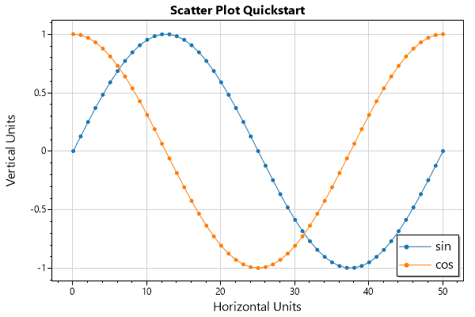


## Quickstart/Quickstart - 5 Million Points


The Signal plot type is ideal for displaying evenly-spaced data. Plots with millions of data points can be interacted with in real time. If the underlying data does not change, SignalConst() may be an even more performant way to display it.


```cs
var plt = new ScottPlot.Plot(600, 400);
Random rand = new Random(0);
int pointCount = (int)1e6;
int lineCount = 5;

for (int i = 0; i < lineCount; i++)
    plt.PlotSignal(DataGen.RandomWalk(rand, pointCount));

plt.Title("Signal Plot Quickstart (5 million points)");
plt.YLabel("Vertical Units");
plt.XLabel("Horizontal Units");
plt.SaveFig("Quickstart_Quickstart_Signal_5MillionPoints.png");
```


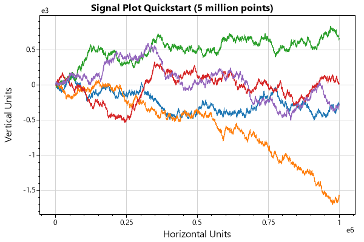


## PlotTypes/Arrow - Plot arrows


arrows can be added which point at specific points on the plot


```cs
var plt = new ScottPlot.Plot(600, 400);
int pointCount = 51;
double[] x = DataGen.Consecutive(pointCount);
double[] sin = DataGen.Sin(pointCount);
double[] cos = DataGen.Cos(pointCount);

plt.PlotScatter(x, sin);
plt.PlotScatter(x, cos);

plt.PlotArrow(25, 0, 27, .2, label: "default");
plt.PlotArrow(27, -.25, 23, -.5, label: "big", lineWidth: 10);
plt.PlotArrow(12, 1, 12, 0, label: "skinny", arrowheadLength: 10);
plt.PlotArrow(20, .6, 20, 1, label: "fat", arrowheadWidth: 10);
plt.Legend(fixedLineWidth: false);
plt.SaveFig("PlotTypes_Arrow_Quickstart.png");
```


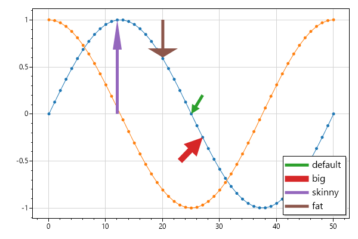


## PlotTypes/AxisLine - Axis Line Quickstart


Horizontal and vertical lines can be placed using HLine() and VLine(). Styling can be customized using arguments.


```cs
var plt = new ScottPlot.Plot(600, 400);
int pointCount = 51;
double[] x = DataGen.Consecutive(pointCount);
double[] sin = DataGen.Sin(pointCount);
double[] cos = DataGen.Cos(pointCount);

plt.PlotScatter(x, sin);
plt.PlotScatter(x, cos);

plt.PlotHLine(y: .85, label: "HLine");
plt.PlotVLine(x: 23, label: "VLine");
plt.PlotVLine(x: 33, label: "VLine too", color: Color.Magenta, lineWidth: 3, lineStyle: LineStyle.Dot);
plt.Legend();
plt.SaveFig("PlotTypes_AxisLine_Quickstart.png");
```


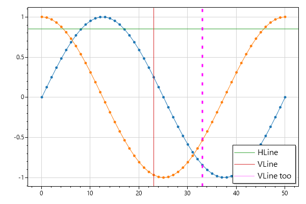


## PlotTypes/AxisLine - Draggable Axis Lines


Use arguments to enable draggable lines (with optional limits).


```cs
var plt = new ScottPlot.Plot(600, 400);
int pointCount = 51;
double[] x = DataGen.Consecutive(pointCount);
double[] sin = DataGen.Sin(pointCount);
double[] cos = DataGen.Cos(pointCount);

plt.PlotScatter(x, sin);
plt.PlotScatter(x, cos);

plt.PlotHLine(y: .85, draggable: true, dragLimitLower: -1, dragLimitUpper: +1);
plt.PlotVLine(x: 23, draggable: true, dragLimitLower: 0, dragLimitUpper: 50);
plt.SaveFig("PlotTypes_AxisLine_Draggable.png");
```


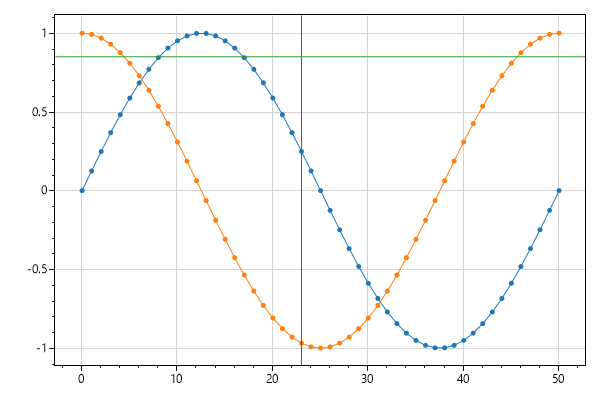


## PlotTypes/AxisSpan - Axis Span Quickstart


Horizontal and vertical spans can be placed using VSpan() and HSpan(). Styling can be customized using arguments.


```cs
var plt = new ScottPlot.Plot(600, 400);
int pointCount = 51;
double[] x = DataGen.Consecutive(pointCount);
double[] sin = DataGen.Sin(pointCount);
double[] cos = DataGen.Cos(pointCount);

plt.PlotScatter(x, sin);
plt.PlotScatter(x, cos);

plt.PlotVSpan(y1: .15, y2: .85, label: "VSpan");
plt.PlotHSpan(x1: 10, x2: 25, label: "HSpan");
plt.Legend();
plt.SaveFig("PlotTypes_AxisSpan_Quickstart.png");
```


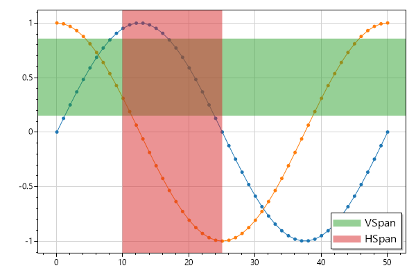


## PlotTypes/AxisSpan - Draggable Axis Spans


Horizontal and vertical spans can be made draggable (with optional limits) using arguments.


```cs
var plt = new ScottPlot.Plot(600, 400);
int pointCount = 51;
double[] x = DataGen.Consecutive(pointCount);
double[] sin = DataGen.Sin(pointCount);
double[] cos = DataGen.Cos(pointCount);

plt.PlotScatter(x, sin);
plt.PlotScatter(x, cos);

plt.PlotVSpan(y1: .15, y2: .85, label: "VSpan", draggable: true, dragLimitLower: -1, dragLimitUpper: 1);
plt.PlotHSpan(x1: 10, x2: 25, label: "HSpan", draggable: true, dragLimitLower: 0, dragLimitUpper: 50);
plt.Legend();
plt.SaveFig("PlotTypes_AxisSpan_Draggable.png");
```


## PlotTypes/Bar - Bar Plot Quickstart


Bar graph series can be created by supply Xs and Ys. Optionally apply errorbars as a third array using an argument.


```cs
var plt = new ScottPlot.Plot(600, 400);
// generate random data to plot
Random rand = new Random(0);
int pointCount = 10;
double[] Xs = new double[pointCount];
double[] dataA = new double[pointCount];
double[] errorA = new double[pointCount];
for (int i = 0; i < pointCount; i++)
{
    Xs[i] = i * 10;
    dataA[i] = rand.NextDouble() * 100;
    errorA[i] = rand.NextDouble() * 10;
}

// make the bar plot
plt.PlotBar(Xs, dataA, errorY: errorA);

// customize the plot to make it look nicer
plt.Axis(null, null, 0, null);
plt.Grid(false);

// apply custom axis tick labels
string[] labels = { "one", "two", "three", "four", "five", "six", "seven", "eight", "nine", "ten" };
plt.XTicks(Xs, labels);
plt.SaveFig("PlotTypes_Bar_Quickstart.png");
```


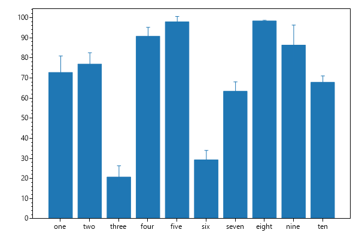


## PlotTypes/Bar - Bar Plot with Errorbars


Error can be supplied as a command line argument.


```cs
var plt = new ScottPlot.Plot(600, 400);
int pointCount = 20;
double[] xs = new double[pointCount];
double[] ys = new double[pointCount];
double[] yErr = new double[pointCount];
Random rand = new Random(0);
for (int i = 0; i < pointCount; i++)
{
    xs[i] = i;
    ys[i] = .5 + rand.NextDouble();
    yErr[i] = rand.NextDouble() * .3 + .05;
}

plt.Title("Bar Plot With Error Bars");
plt.PlotBar(xs, ys, barWidth: .5, errorY: yErr, errorCapSize: 2);
plt.Grid(enableVertical: false);
plt.Axis(null, null, 0, null);
plt.SaveFig("PlotTypes_Bar_BarWithError.png");
```


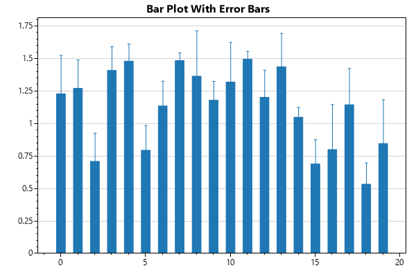


## PlotTypes/Bar - Multiple Bar Graphs


Multiple bar graphs can be displayed together by tweaking the widths and offsets of two separate bar graphs.


```cs
var plt = new ScottPlot.Plot(600, 400);
// generate random data to plot
Random rand = new Random(0);
int pointCount = 10;
double[] Xs = new double[pointCount];
double[] dataA = new double[pointCount];
double[] errorA = new double[pointCount];
double[] dataB = new double[pointCount];
double[] errorB = new double[pointCount];
for (int i = 0; i < pointCount; i++)
{
    Xs[i] = i * 10;
    dataA[i] = rand.NextDouble() * 100;
    dataB[i] = rand.NextDouble() * 100;
    errorA[i] = rand.NextDouble() * 10;
    errorB[i] = rand.NextDouble() * 10;
}

// add both bar plots with a careful widths and offsets
plt.PlotBar(Xs, dataA, errorY: errorA, label: "data A", barWidth: 3.2, xOffset: -2);
plt.PlotBar(Xs, dataB, errorY: errorB, label: "data B", barWidth: 3.2, xOffset: 2);

// customize the plot to make it look nicer
plt.Grid(false);
plt.Axis(null, null, 0, null);
plt.Legend();

// apply custom axis tick labels
string[] labels = { "one", "two", "three", "four", "five", "six", "seven", "eight", "nine", "ten" };
plt.XTicks(Xs, labels);
plt.SaveFig("PlotTypes_Bar_MultipleBars.png");
```


## PlotTypes/Finance - Financial OHLC Chart


Display OHLC (open, high, low, close) data by plotting an array of OHLC objects.


```cs
var plt = new ScottPlot.Plot(600, 400);
ScottPlot.OHLC[] ohlcs = DataGen.RandomStockPrices(rand: null, pointCount: 60, deltaMinutes: 10);
plt.Title("Open/High/Low/Close (OHLC) Chart");
plt.YLabel("Stock Price (USD)");
plt.PlotOHLC(ohlcs);
plt.Ticks(dateTimeX: true);
plt.SaveFig("PlotTypes_Finance_OHLC.png");
```


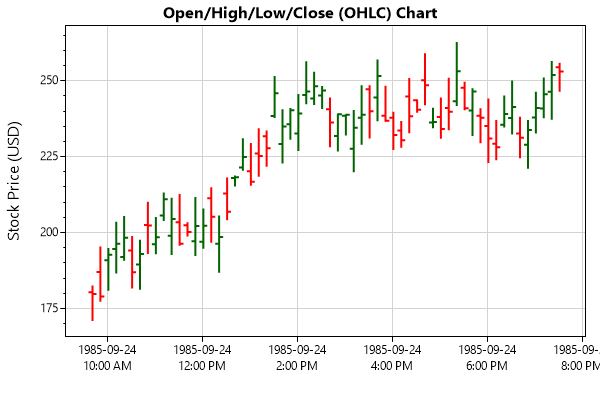


## PlotTypes/Finance - Financial Candlestick Chart


Display OHLC (open, high, low, close) data by plotting an array of OHLC objects.


```cs
var plt = new ScottPlot.Plot(600, 400);
ScottPlot.OHLC[] ohlcs = DataGen.RandomStockPrices(rand: null, pointCount: 60, deltaMinutes: 10);
plt.Title("Ten Minute Candlestick Chart");
plt.YLabel("Stock Price (USD)");
plt.PlotCandlestick(ohlcs);
plt.Ticks(dateTimeX: true);
ScottPlot.OHLC[] ohlcs = ScottPlot.DataGen.RandomStockPrices(rand: null, pointCount: 30, deltaDays: 1);

plt.Title("Daily Candlestick Chart (weekends skipped)");
plt.YLabel("Stock Price (USD)");
plt.PlotCandlestick(ohlcs);
plt.Ticks(dateTimeX: true);
// start with stock prices which have unevenly spaced time points (weekends are skipped)
ScottPlot.OHLC[] ohlcs = DataGen.RandomStockPrices(rand: null, pointCount: 30);

// replace timestamps with a series of numbers starting at 0
for (int i = 0; i < ohlcs.Length; i++)
    ohlcs[i].time = i;

// plot the candlesticks (the horizontal axis will start at 0)
plt.Title("Daily Candlestick Chart (evenly spaced)");
plt.YLabel("Stock Price (USD)");
plt.PlotCandlestick(ohlcs);

// create ticks manually
double[] tickPositions = { 0, 6, 13, 20, 27 };
string[] tickLabels = { "Sep 23", "Sep 30", "Oct 7", "Oct 14", "Oct 21" };
plt.XTicks(tickPositions, tickLabels);
plt.SaveFig("PlotTypes_Finance_Candle.png");
```


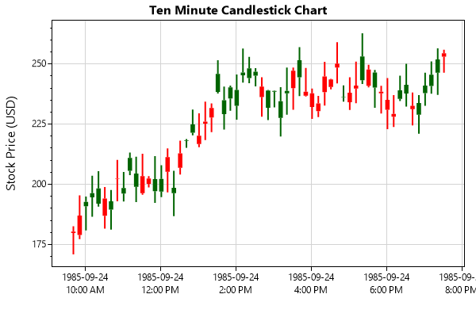


## PlotTypes/Finance - OHLC with gaps


This example demonstrates that by default the horizontal axis is strictly linear. Missing OHLC data produces gaps in the plot.


```cs
var plt = new ScottPlot.Plot(600, 400);
ScottPlot.OHLC[] ohlcs = ScottPlot.DataGen.RandomStockPrices(rand: null, pointCount: 30, deltaDays: 1);

plt.Title("Daily Candlestick Chart (weekends skipped)");
plt.YLabel("Stock Price (USD)");
plt.PlotCandlestick(ohlcs);
plt.Ticks(dateTimeX: true);
plt.SaveFig("PlotTypes_Finance_CandleSkipWeekends.png");
```


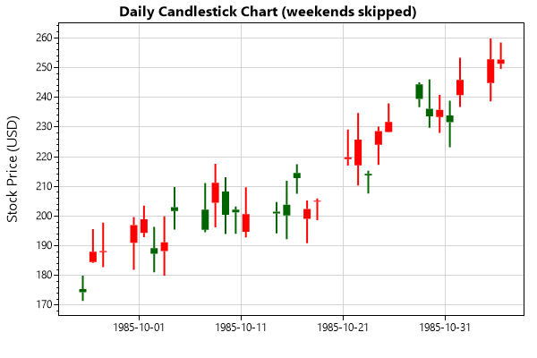


## PlotTypes/Finance - OHLC without gaps


This example demonstrates how to plot OHLC data continuously even though there are gaps on the horizontal axis (for days the market is closed). The strategy is to plot it on a linear horizontal axis (not a DateTime axis) and then to come back later and define custom tick labels.


```cs
var plt = new ScottPlot.Plot(600, 400);
// start with stock prices which have unevenly spaced time points (weekends are skipped)
ScottPlot.OHLC[] ohlcs = DataGen.RandomStockPrices(rand: null, pointCount: 30);

// replace timestamps with a series of numbers starting at 0
for (int i = 0; i < ohlcs.Length; i++)
    ohlcs[i].time = i;

// plot the candlesticks (the horizontal axis will start at 0)
plt.Title("Daily Candlestick Chart (evenly spaced)");
plt.YLabel("Stock Price (USD)");
plt.PlotCandlestick(ohlcs);

// create ticks manually
double[] tickPositions = { 0, 6, 13, 20, 27 };
string[] tickLabels = { "Sep 23", "Sep 30", "Oct 7", "Oct 14", "Oct 21" };
plt.XTicks(tickPositions, tickLabels);
plt.SaveFig("PlotTypes_Finance_CandleNoSkippedDays.png");
```


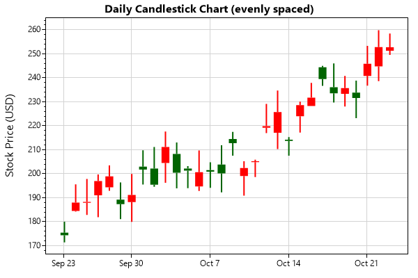


## PlotTypes/Function - Function Plot


A function (not data points) is provided to create this plot. Axes can be zoomed infinitely. For functions with a restricted domain, you should return null to prevent errors.

e.g. new Func<double, double?>((x) => x > 0 ? Math.Log(x) : (double?)null);


```cs
var plt = new ScottPlot.Plot(600, 400);
var func = new Func<double, double?>((x) => Math.Sin(x) * Math.Sin(10 * x));
plt.PlotFunction(func);
plt.SaveFig("PlotTypes_Function_Quickstart.png");
```


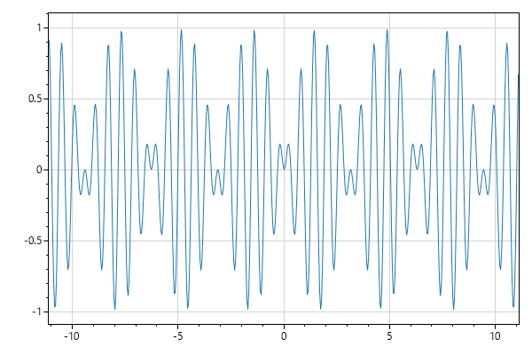


## PlotTypes/Point - Plot points


Points are essentially scatter plots with a single point.


```cs
var plt = new ScottPlot.Plot(600, 400);
int pointCount = 51;
double[] x = DataGen.Consecutive(pointCount);
double[] sin = DataGen.Sin(pointCount);
double[] cos = DataGen.Cos(pointCount);

plt.PlotScatter(x, sin);
plt.PlotScatter(x, cos);

plt.PlotPoint(25, 0.8);
plt.PlotPoint(30, 0.3, color: Color.Magenta, markerSize: 15);
plt.SaveFig("PlotTypes_Point_Quickstart.png");
```


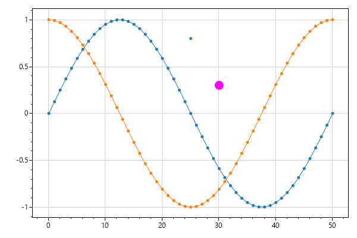


## PlotTypes/Scatter - Scatter Plot Quickstart


Scatter plots are best for small numbers of paired X/Y data points. For evenly-spaced data points Signal is much faster.


```cs
var plt = new ScottPlot.Plot(600, 400);
int pointCount = 51;
double[] x = DataGen.Consecutive(pointCount);
double[] sin = DataGen.Sin(pointCount);
double[] cos = DataGen.Cos(pointCount);

plt.PlotScatter(x, sin);
plt.PlotScatter(x, cos);
plt.SaveFig("PlotTypes_Scatter_Quickstart.png");
```


## PlotTypes/Scatter - Custom markers


Arguments allow markers to be customized


```cs
var plt = new ScottPlot.Plot(600, 400);
int pointCount = 51;
double[] x = DataGen.Consecutive(pointCount);
double[] sin = DataGen.Sin(pointCount);
double[] cos = DataGen.Cos(pointCount);

plt.PlotScatter(x, sin, markerSize: 15, markerShape: MarkerShape.openCircle);
plt.PlotScatter(x, cos, markerSize: 7, markerShape: MarkerShape.filledSquare);
plt.SaveFig("PlotTypes_Scatter_CustomizeMarkers.png");
```


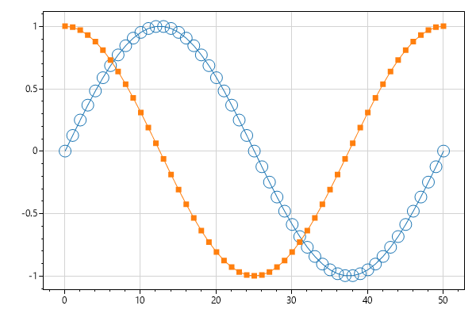


## PlotTypes/Scatter - All marker shapes


This plot demonstrates all available markers


```cs
var plt = new ScottPlot.Plot(600, 400);
int pointCount = 51;
double[] x = DataGen.Consecutive(pointCount);

string[] markerShapeNames = Enum.GetNames(typeof(MarkerShape));
for (int i = 0; i < markerShapeNames.Length; i++)
{
    string markerShapeName = markerShapeNames[i];
    MarkerShape markerShape = (MarkerShape)Enum.Parse(typeof(MarkerShape), markerShapeName);
    double[] sin = DataGen.Sin(pointCount, 2, -i);
    plt.PlotScatter(x, sin, label: markerShapeName, markerShape: markerShape, markerSize: 7);
}

plt.Grid(false);
plt.Legend(fontSize: 10);
plt.SaveFig("PlotTypes_Scatter_AllMarkers.png");
```


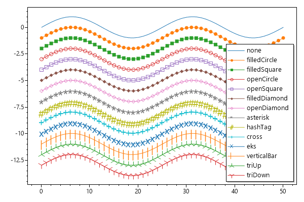


## PlotTypes/Scatter - Custom lines


Arguments allow line color, size, and pattern to be customized. Setting markerSize to 0 prevents markers from being rendered.


```cs
var plt = new ScottPlot.Plot(600, 400);
int pointCount = 51;
double[] x = DataGen.Consecutive(pointCount);
double[] sin = DataGen.Sin(pointCount);
double[] cos = DataGen.Cos(pointCount);
double[] cos2 = DataGen.Cos(pointCount, mult: -1);

plt.PlotScatter(x, sin, color: Color.Magenta, label: "sin", lineWidth: 0, markerSize: 10);
plt.PlotScatter(x, cos, color: Color.Green, label: "cos", lineWidth: 5, markerSize: 0);
plt.PlotScatter(x, cos2, color: Color.Blue, label: "-cos", lineWidth: 3, markerSize: 0, lineStyle: LineStyle.DashDot);

plt.Legend(fixedLineWidth: false);
plt.SaveFig("PlotTypes_Scatter_CustomizeLines.png");
```


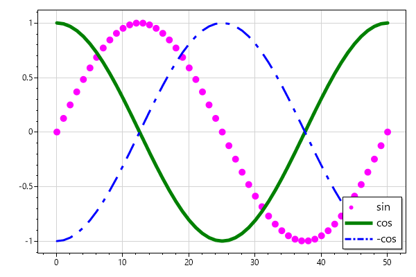


## PlotTypes/Scatter - Random X/Y Points


X data for scatter plots does not have to be evenly spaced, making scatter plots are ideal for displaying random data like this.


```cs
var plt = new ScottPlot.Plot(600, 400);
Random rand = new Random(0);
int pointCount = 51;
double[] xs1 = DataGen.RandomNormal(rand, pointCount, 1);
double[] xs2 = DataGen.RandomNormal(rand, pointCount, 3);
double[] ys1 = DataGen.RandomNormal(rand, pointCount, 5);
double[] ys2 = DataGen.RandomNormal(rand, pointCount, 7);

plt.PlotScatter(xs1, ys1, markerSize: 0, label: "lines only");
plt.PlotScatter(xs2, ys2, lineWidth: 0, label: "markers only");
plt.Legend();
plt.SaveFig("PlotTypes_Scatter_RandomXY.png");
```


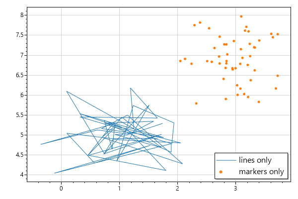


## PlotTypes/Scatter - Scatter Plot with Errorbars


X and Y error ranges can be supplied as optional double arrays


```cs
var plt = new ScottPlot.Plot(600, 400);
Random rand = new Random(0);
int pointCount = 20;

for (int plotNumber = 0; plotNumber < 3; plotNumber++)
{
    // create random data to plot
    double[] dataX = new double[pointCount];
    double[] dataY = new double[pointCount];
    double[] errorY = new double[pointCount];
    double[] errorX = new double[pointCount];
    for (int i = 0; i < pointCount; i++)
    {
        dataX[i] = i + rand.NextDouble();
        dataY[i] = rand.NextDouble() * 100 + 100 * plotNumber;
        errorX[i] = rand.NextDouble();
        errorY[i] = rand.NextDouble() * 10;
    }

    // demonstrate different ways to plot errorbars
    if (plotNumber == 0)
        plt.PlotScatter(dataX, dataY, lineWidth: 0, errorY: errorY, errorX: errorX, label: $"X and Y errors");
    else if (plotNumber == 1)
        plt.PlotScatter(dataX, dataY, lineWidth: 0, errorY: errorY, label: $"Y errors only");
    else
        plt.PlotScatter(dataX, dataY, errorY: errorY, errorX: errorX, label: $"Connected Errors");
}
plt.SaveFig("PlotTypes_Scatter_ErrorBars.png");
```


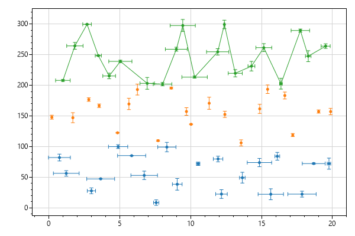


## PlotTypes/Scatter - Save scatter plot data


Many plot types have a .SaveCSV() method


```cs
var plt = new ScottPlot.Plot(600, 400);
int pointCount = 51;
double[] dataXs = DataGen.Consecutive(pointCount);
double[] dataSin = DataGen.Sin(pointCount);

var scatter = plt.PlotScatter(dataXs, dataSin);
scatter.SaveCSV("scatter.csv");
plt.SaveFig("PlotTypes_Scatter_SaveData.png");
```


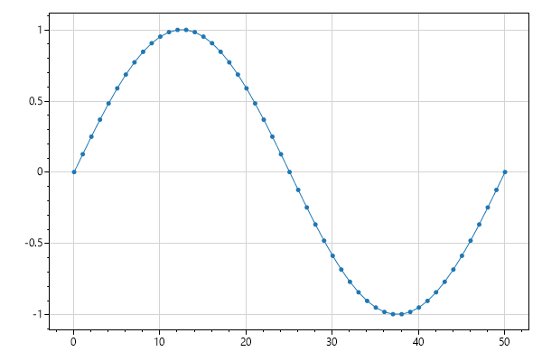


## PlotTypes/Signal - Signal Plot Quickstart


no description provided...


```cs
var plt = new ScottPlot.Plot(600, 400);
double[] signalData = DataGen.RandomWalk(null, 100_000);
double sampleRateHz = 20000;

plt.Title($"Signal Plot ({signalData.Length.ToString("N0")} points)");
plt.PlotSignal(signalData, sampleRateHz);
plt.SaveFig("PlotTypes_Signal_Quickstart.png");
```


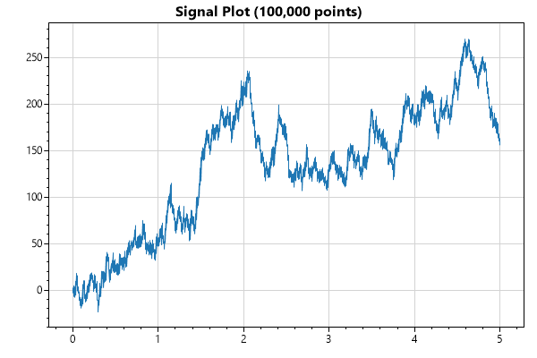


## PlotTypes/Signal - Styled Signal Plot


Signal plot with styled lines and markers


```cs
var plt = new ScottPlot.Plot(600, 400);
Random rand = new Random(0);
double[] ys = DataGen.RandomWalk(rand, 500);

plt.Title($"Signal Plot with Markers");
plt.PlotSignal(ys, label: "default");
plt.PlotSignal(ys, yOffset: 20, markerSize: 10, label: "large markers");
plt.PlotSignal(ys, yOffset: 40, lineWidth: 10, markerSize: 0, label: "large line");
plt.Legend();
plt.SaveFig("PlotTypes_Signal_CustomLineAndMarkers.png");
```


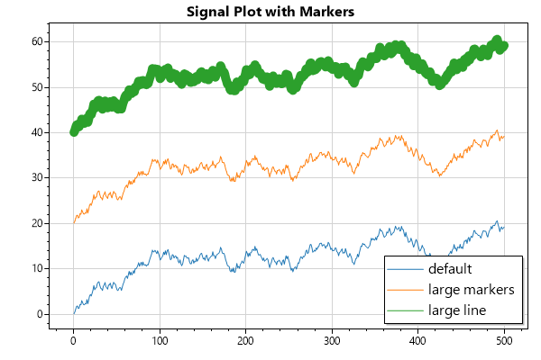


## PlotTypes/Signal - 5M points (Signal)


Signal plots with millions of points can be interacted with in real time.


```cs
var plt = new ScottPlot.Plot(600, 400);
Random rand = new Random(0);
int pointCount = 1_000_000;
int lineCount = 5;

for (int i = 0; i < lineCount; i++)
    plt.PlotSignal(DataGen.RandomWalk(rand, pointCount));
plt.SaveFig("PlotTypes_Signal_RandomWalk_5millionPoints_Signal.png");
```


## PlotTypes/Signal - Save signal plot data


Many plot types have a .SaveCSV() method


```cs
var plt = new ScottPlot.Plot(600, 400);
int pointCount = 51;
double[] dataSin = DataGen.Sin(pointCount);

var scatter = plt.PlotSignal(dataSin);
scatter.SaveCSV("signal.csv");
plt.SaveFig("PlotTypes_Signal_SaveData.png");
```


## PlotTypes/Signal - Display data density


When plotting extremely high density data, you can't always see the trends underneath all those overlapping data points. If you send an array of colors to PlotSignal(), it will use those colors to display density.


```cs
var plt = new ScottPlot.Plot(600, 400);
// create an extremely noisy signal with a subtle sine wave beneath it
Random rand = new Random(0);
int pointCount = 100_000;
double[] signal1 = ScottPlot.DataGen.Sin(pointCount, 3);
double[] noise = ScottPlot.DataGen.RandomNormal(rand, pointCount, 0, 5);
double[] data = new double[pointCount];
for (int i = 0; i < data.Length; i++)
    data[i] = signal1[i] + noise[i];

// plot the noisy signal using the traditional method
plt.PlotSignal(data, yOffset: -40, color: Color.Red);

// use a color array for displaying data from low to high density
Color[] colors = new Color[]
{
    ColorTranslator.FromHtml("#440154"),
    ColorTranslator.FromHtml("#39568C"),
    ColorTranslator.FromHtml("#1F968B"),
    ColorTranslator.FromHtml("#73D055"),
};

plt.PlotSignal(data, colorByDensity: colors);

plt.Title("Color by Density vs. Solid Color");
plt.AxisAuto(0, .1);
plt.SaveFig("PlotTypes_Signal_Density.png");
```


## PlotTypes/Signal - Display first N points


When plotting live data it is useful to allocate a large array in memory then fill it with values as they come in. By setting the maxRenderIndex property of a scatter plot to can prevent rendering the end of the array (which is probably filled with zeros).


```cs
var plt = new ScottPlot.Plot(600, 400);
// Allocate memory for a large number of data points
double[] data = new double[1_000_000]; // start with all zeros

// Only populate the first few points with real data
Random rand = new Random(0);
int lastValueIndex = 500;
for (int i = 1; i <= lastValueIndex; i++)
    data[i] = data[i - 1] + rand.NextDouble() - .5;

// A regular Signal plot would display a little data at the start but mostly zeros.
// Using the maxRenderIndex argument allows one to just plot the first N data points.
var sig = plt.PlotSignal(data, maxRenderIndex: lastValueIndex);
plt.Title("Partial Display of a 1,000,000 Element Array");
plt.YLabel("Value");
plt.XLabel("Array Index");

// you can change the points to plot later (useful for live plots of incoming data)
sig.maxRenderIndex = 1234;
plt.SaveFig("PlotTypes_Signal_FirstNPoints.png");
```


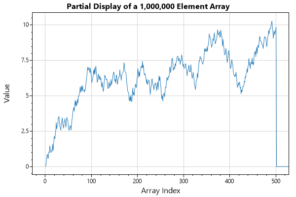


## PlotTypes/SignalConst - 5M points (SignalConst)


SignalConst plots pre-processes data to render much faster than Signal plots. Pre-processing takes a little time up-front and requires 4x the memory of Signal.


```cs
var plt = new ScottPlot.Plot(600, 400);
Random rand = new Random(0);
int pointCount = 1_000_000;
int lineCount = 5;

for (int i = 0; i < lineCount; i++)
    plt.PlotSignalConst(DataGen.RandomWalk(rand, pointCount));
plt.SaveFig("PlotTypes_SignalConst_RandomWalk_5millionPoints_SignalConst.png");
```


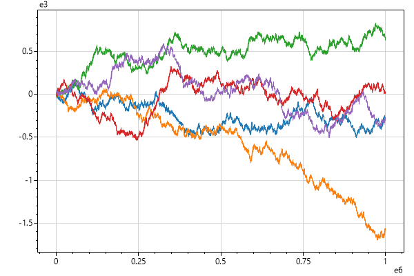


## PlotTypes/Step - Step Plot Quickstart


Step plots are really just scatter plots whose points are connected by elbows rather than straight lines.


```cs
var plt = new ScottPlot.Plot(600, 400);
int pointCount = 51;
double[] x = DataGen.Consecutive(pointCount);
double[] sin = DataGen.Sin(pointCount);
double[] cos = DataGen.Cos(pointCount);

plt.PlotStep(x, sin);
plt.PlotStep(x, cos);
plt.SaveFig("PlotTypes_Step_Quickstart.png");
```


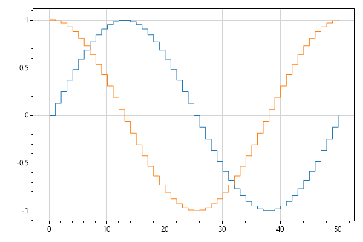


## PlotTypes/Text - Text Quickstart


Text can be placed at any X/Y location and styled using arguments.


```cs
var plt = new ScottPlot.Plot(600, 400);
int pointCount = 51;
double[] x = DataGen.Consecutive(pointCount);
double[] sin = DataGen.Sin(pointCount);
double[] cos = DataGen.Cos(pointCount);

plt.PlotScatter(x, sin);
plt.PlotScatter(x, cos);

plt.PlotText("demo text", 10, .5, fontName: "comic sans ms", fontSize: 42, color: Color.Magenta, bold: true);
plt.SaveFig("PlotTypes_Text_Quickstart.png");
```


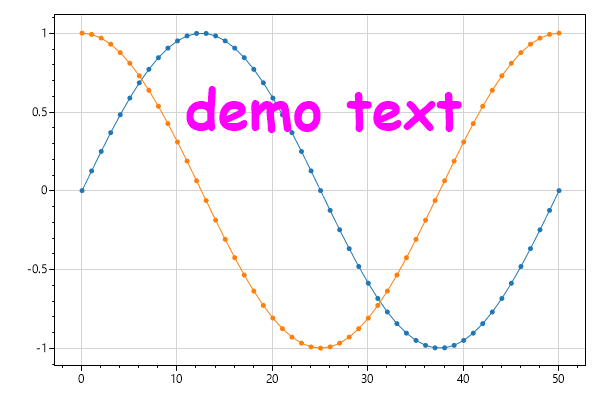


## PlotTypes/Text - Text Alignment


Text alignment and rotation can be customized using arguments.


```cs
var plt = new ScottPlot.Plot(600, 400);
int pointCount = 51;
double[] x = DataGen.Consecutive(pointCount);
double[] sin = DataGen.Sin(pointCount);
double[] cos = DataGen.Cos(pointCount);

plt.PlotScatter(x, sin);
plt.PlotScatter(x, cos);

plt.PlotPoint(25, 0.8, color: Color.Green);
plt.PlotText(" important point", 25, 0.8, color: Color.Green);

plt.PlotPoint(30, 0.3, color: Color.Black, markerSize: 15);
plt.PlotText(" default alignment", 30, 0.3, fontSize: 16, bold: true, color: Color.Magenta);

plt.PlotPoint(30, 0, color: Color.Black, markerSize: 15);
plt.PlotText("middle center", 30, 0, fontSize: 16, bold: true, color: Color.Magenta, alignment: TextAlignment.middleCenter);

plt.PlotPoint(30, -0.3, color: Color.Black, markerSize: 15);
plt.PlotText("upper left", 30, -0.3, fontSize: 16, bold: true, color: Color.Magenta, alignment: TextAlignment.upperLeft);

plt.PlotPoint(5, -.5, color: Color.Blue, markerSize: 15);
plt.PlotText(" Rotated Text", 5, -.5, fontSize: 16, color: Color.Blue, bold: true, rotation: -30);

plt.PlotText("Framed Text", 15, -.6, fontSize: 16, color: Color.White, bold: true, frame: true, frameColor: Color.DarkRed);
plt.SaveFig("PlotTypes_Text_Alignment.png");
```


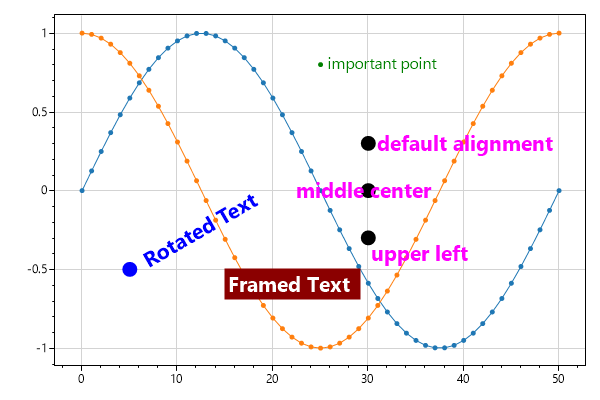


## Customize/Axis - Title and Axis Labels


Title and axis labels can be defined and custoized using arguments.


```cs
var plt = new ScottPlot.Plot(600, 400);
int pointCount = 51;
double[] x = DataGen.Consecutive(pointCount);
double[] sin = DataGen.Sin(pointCount);
double[] cos = DataGen.Cos(pointCount);

plt.PlotScatter(x, sin);
plt.PlotScatter(x, cos);

plt.Title("Plot Title");
plt.XLabel("Horizontal Axis");
plt.YLabel("Vertical Axis");
plt.SaveFig("Customize_Axis_AxisLabels.png");
```


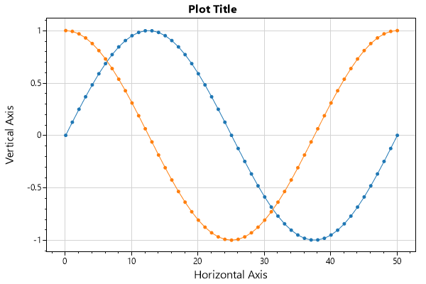


## Customize/Axis - Ruler Mode


Ruler mode is an alternative way to display axis tick labels


```cs
var plt = new ScottPlot.Plot(600, 400);
int pointCount = 51;
double[] x = DataGen.Consecutive(pointCount);
double[] sin = DataGen.Sin(pointCount);
double[] cos = DataGen.Cos(pointCount);

plt.PlotScatter(x, sin);
plt.PlotScatter(x, cos);

plt.Ticks(rulerModeX: true, rulerModeY: true);
int pointCount = 51;
double[] x = DataGen.Consecutive(pointCount);
double[] sin = DataGen.Sin(pointCount);
double[] cos = DataGen.Cos(pointCount);

plt.PlotScatter(x, sin);
plt.PlotScatter(x, cos);

plt.Ticks(rulerModeX: true, displayTicksY: false);
plt.Frame(left: false, right: false, top: false);
plt.TightenLayout(padding: 0, render: true);
plt.SaveFig("Customize_Axis_RulerMode.png");
```


## Customize/Axis - Ruler Mode (X only)


Ruler mode only on one axis


```cs
var plt = new ScottPlot.Plot(600, 400);
int pointCount = 51;
double[] x = DataGen.Consecutive(pointCount);
double[] sin = DataGen.Sin(pointCount);
double[] cos = DataGen.Cos(pointCount);

plt.PlotScatter(x, sin);
plt.PlotScatter(x, cos);

plt.Ticks(rulerModeX: true, displayTicksY: false);
plt.Frame(left: false, right: false, top: false);
plt.TightenLayout(padding: 0, render: true);
plt.SaveFig("Customize_Axis_RulerModeXOnly.png");
```


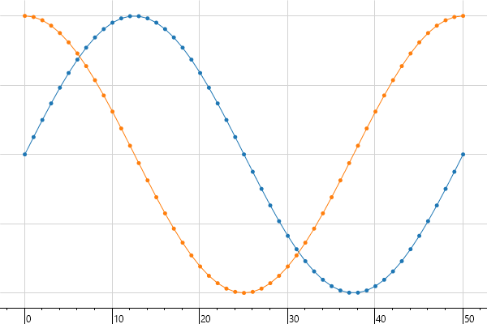


## Customize/Axis - Log Axis


```cs
var plt = new ScottPlot.Plot(600, 400);
// generate some interesting log-distributed data
int pointCount = 200;
double[] dataXs = new double[pointCount];
double[] dataYs = new double[pointCount];
Random rand = new Random(0);
for (int i = 0; i < pointCount; i++)
{
    double x = 10.0 * i / pointCount;
    dataXs[i] = x;
    dataYs[i] = Math.Pow(2, x) + rand.NextDouble() * i;
}

plt.PlotScatter(dataXs, ScottPlot.Tools.Log10(dataYs), lineWidth: 0);
plt.Title("Data (Log Scale)");
plt.YLabel("Vertical Units (10^x)");
plt.XLabel("Horizontal Units");
plt.SaveFig("Customize_Axis_LogAxis.png");
```


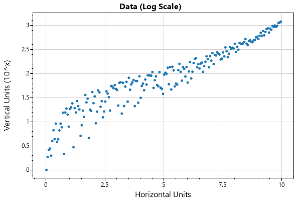


## Customize/Axis - Polar Axis


```cs
var plt = new ScottPlot.Plot(600, 400);
// create some data with polar coordinates
int count = 400;
double step = 0.01;

double[] rs = new double[count];
double[] thetas = new double[count];

for (int i = 0; i < rs.Length; i++)
{
    rs[i] = 1 + i * step;
    thetas[i] = i * 2 * Math.PI * step;
}

// convert polar data to Cartesian data
(double[] xs, double[] ys) = ScottPlot.Tools.ConvertPolarCoordinates(rs, thetas);

// plot the Cartesian data
plt.PlotScatter(xs, ys);
plt.Title("Scatter Plot of Polar Data");
plt.EqualAxis = true;
plt.SaveFig("Customize_Axis_PolarAxis.png");
```


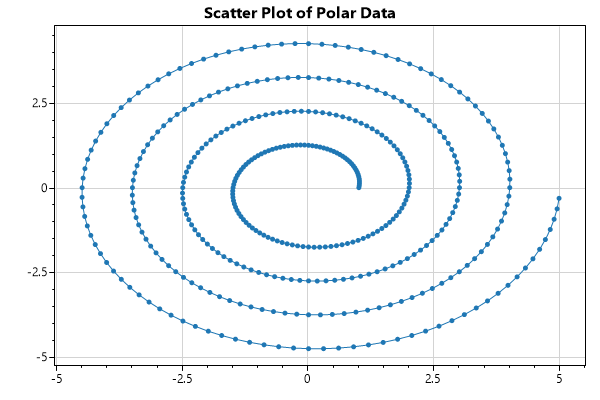


## Customize/AxisLimits - Automatically fit to data


Automatically adjust axis limits to fit data. By default the data is slightly padded with extra space.


```cs
var plt = new ScottPlot.Plot(600, 400);
int pointCount = 51;
double[] x = DataGen.Consecutive(pointCount);
double[] sin = DataGen.Sin(pointCount);
double[] cos = DataGen.Cos(pointCount);

plt.PlotScatter(x, sin);
plt.PlotScatter(x, cos);

plt.AxisAuto();
int pointCount = 51;
double[] x = DataGen.Consecutive(pointCount);
double[] sin = DataGen.Sin(pointCount);
double[] cos = DataGen.Cos(pointCount);

plt.PlotScatter(x, sin);
plt.PlotScatter(x, cos);

plt.AxisAuto(horizontalMargin: 0, verticalMargin: 0.5);
plt.SaveFig("Customize_AxisLimits_Auto.png");
```


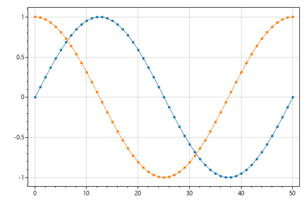


## Customize/AxisLimits - Automatic fit with specified margin


AxisAuto() arguments allow the user to define the amount of padding (margin) for each axis. Setting the margin to 0 will adjust the plot axis limits to tightly fit the data.


```cs
var plt = new ScottPlot.Plot(600, 400);
int pointCount = 51;
double[] x = DataGen.Consecutive(pointCount);
double[] sin = DataGen.Sin(pointCount);
double[] cos = DataGen.Cos(pointCount);

plt.PlotScatter(x, sin);
plt.PlotScatter(x, cos);

plt.AxisAuto(horizontalMargin: 0, verticalMargin: 0.5);
plt.SaveFig("Customize_AxisLimits_AutoMargin.png");
```


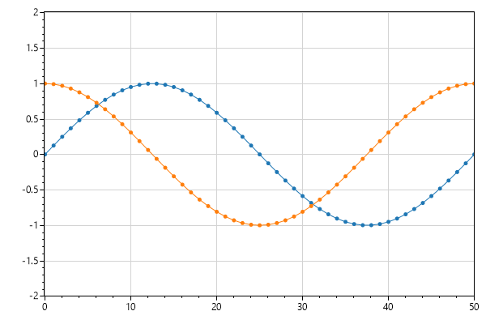


## Customize/AxisLimits - Manually define axis limits


The user can manually define axis limits. If a null is passed in, that axis limit is not adjusted.


```cs
var plt = new ScottPlot.Plot(600, 400);
int pointCount = 51;
double[] x = DataGen.Consecutive(pointCount);
double[] sin = DataGen.Sin(pointCount);
double[] cos = DataGen.Cos(pointCount);

plt.PlotScatter(x, sin);
plt.PlotScatter(x, cos);

plt.Axis(-10, 60, -3, 3);
plt.SaveFig("Customize_AxisLimits_Manual.png");
```


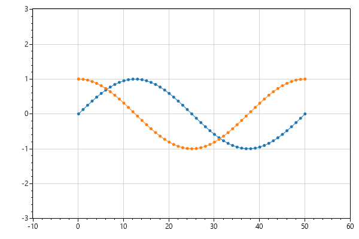


## Customize/AxisLimits - Zoom


The user can easily zoom and zoom by providing a fractional zoom amount. Numbers >1 zoom in while numbers <1 zoom out.


```cs
var plt = new ScottPlot.Plot(600, 400);
int pointCount = 51;
double[] x = DataGen.Consecutive(pointCount);
double[] sin = DataGen.Sin(pointCount);
double[] cos = DataGen.Cos(pointCount);

plt.PlotScatter(x, sin);
plt.PlotScatter(x, cos);

plt.AxisZoom(2, 2);
plt.SaveFig("Customize_AxisLimits_Zoom.png");
```


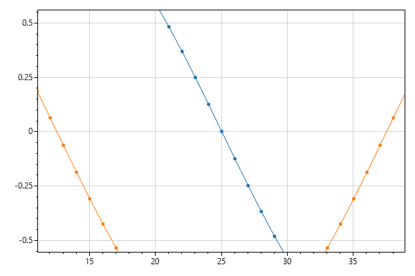


## Customize/AxisLimits - Pan


The user can easily pan by a defined amount on each axis.


```cs
var plt = new ScottPlot.Plot(600, 400);
int pointCount = 51;
double[] x = DataGen.Consecutive(pointCount);
double[] sin = DataGen.Sin(pointCount);
double[] cos = DataGen.Cos(pointCount);

plt.PlotScatter(x, sin);
plt.PlotScatter(x, cos);

plt.AxisPan(-10, .5);
plt.SaveFig("Customize_AxisLimits_Pan.png");
```


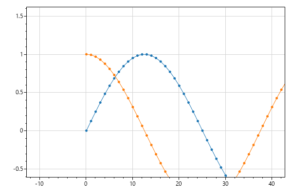


## Customize/Figure - Figure and Data Background


Figure and data area background colors can be set individually.


```cs
var plt = new ScottPlot.Plot(600, 400);
int pointCount = 51;
double[] x = DataGen.Consecutive(pointCount);
double[] sin = DataGen.Sin(pointCount);
double[] cos = DataGen.Cos(pointCount);

plt.PlotScatter(x, sin);
plt.PlotScatter(x, cos);

plt.Style(figBg: Color.LightBlue);
plt.Style(dataBg: Color.LightYellow);
plt.SaveFig("Customize_Figure_Background.png");
```


## Customize/Figure - Corner Frame


The data are is typically surrounded by a frame (a 1px line). This frame can be customized using arguments.


```cs
var plt = new ScottPlot.Plot(600, 400);
int pointCount = 51;
double[] x = DataGen.Consecutive(pointCount);
double[] sin = DataGen.Sin(pointCount);
double[] cos = DataGen.Cos(pointCount);

plt.PlotScatter(x, sin);
plt.PlotScatter(x, cos);

plt.Frame(left: true, bottom: true, top: false, right: false);
plt.SaveFig("Customize_Figure_Frame.png");
```


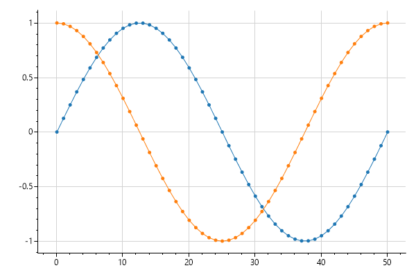


## Customize/Figure - Figure Padding


Extra padding can be added around the data area if desired.


```cs
var plt = new ScottPlot.Plot(600, 400);
int pointCount = 51;
double[] x = DataGen.Consecutive(pointCount);
double[] sin = DataGen.Sin(pointCount);
double[] cos = DataGen.Cos(pointCount);

plt.PlotScatter(x, sin);
plt.PlotScatter(x, cos);

// custom colors are used to make it easier to see the data and figure areas
plt.Style(figBg: Color.LightBlue);
plt.Style(dataBg: Color.LightYellow);

plt.Layout(yScaleWidth: 80, titleHeight: 50, xLabelHeight: 20, y2LabelWidth: 20);
plt.SaveFig("Customize_Figure_FigurePadding.png");
```


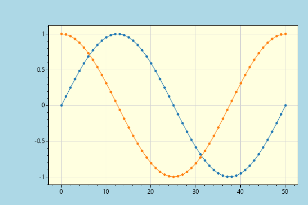


## Customize/Figure - No Padding


This example shows how to only plot the data area (no axis labels, ticks, or tick labels)


```cs
var plt = new ScottPlot.Plot(600, 400);
int pointCount = 51;
double[] x = DataGen.Consecutive(pointCount);
double[] sin = DataGen.Sin(pointCount);
double[] cos = DataGen.Cos(pointCount);

plt.PlotScatter(x, sin);
plt.PlotScatter(x, cos);

// custom colors are used to make it easier to see the data and figure areas
plt.Style(figBg: Color.LightBlue);
plt.Style(dataBg: Color.LightYellow);

plt.Ticks(false, false);
plt.Frame(false);
plt.TightenLayout(padding: 0);
plt.SaveFig("Customize_Figure_NoPad.png");
```


## Customize/Grid - Hide the grid


Grid visibility (and numerous other options) are available as arguments in the Grid() method.


```cs
var plt = new ScottPlot.Plot(600, 400);
int pointCount = 51;
double[] x = DataGen.Consecutive(pointCount);
double[] sin = DataGen.Sin(pointCount);
double[] cos = DataGen.Cos(pointCount);

plt.PlotScatter(x, sin);
plt.PlotScatter(x, cos);

plt.Grid(enable: false);
plt.SaveFig("Customize_Grid_Hide.png");
```


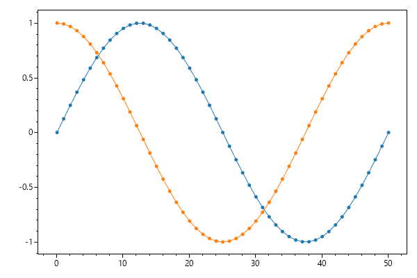


## Customize/Grid - Defined Grid Spacing


The space between grid lines (the same as tick marks) can be manually defined.


```cs
var plt = new ScottPlot.Plot(600, 400);
int pointCount = 51;
double[] x = DataGen.Consecutive(pointCount);
double[] sin = DataGen.Sin(pointCount);
double[] cos = DataGen.Cos(pointCount);

plt.PlotScatter(x, sin);
plt.PlotScatter(x, cos);

plt.Grid(xSpacing: 2, ySpacing: .1);
plt.SaveFig("Customize_Grid_DefineSpacing.png");
```


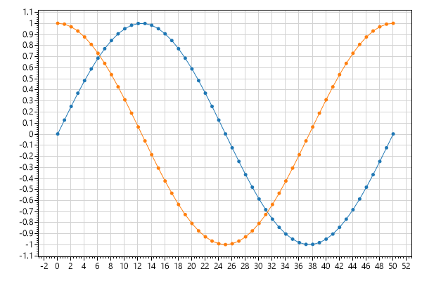


## Customize/PlotStyle - Modify styles after plotting


Styles are typically defined as arguments when data is initially plotted. However, plotting functions return objects which contain style information that can be modified after it has been plotted. In some cases these properties allow more extensive customization than the initial function arguments.


```cs
var plt = new ScottPlot.Plot(600, 400);
int pointCount = 51;
double[] x = DataGen.Consecutive(pointCount);
double[] sin = DataGen.Sin(pointCount);
double[] cos = DataGen.Cos(pointCount);

var plot1 = plt.PlotScatter(x, sin);
var plot2 = plt.PlotScatter(x, cos);

plot1.lineWidth = 5;
plot1.markerShape = MarkerShape.openCircle;
plot1.markerSize = 20;

plot2.color = Color.Magenta;
plt.SaveFig("Customize_PlotStyle_ModifyAfterPlot.png");
```


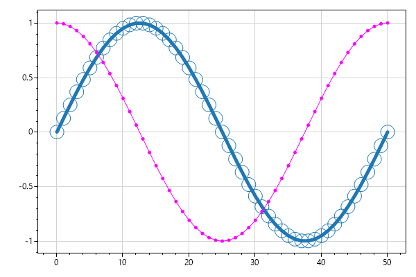


## Customize/PlotStyle - Custom Fonts Everywhere


Uses cutom font, color, and sizes for numerous types of labels


```cs
var plt = new ScottPlot.Plot(600, 400);
int pointCount = 51;
double[] x = DataGen.Consecutive(pointCount);
double[] sin = DataGen.Sin(pointCount);
double[] cos = DataGen.Cos(pointCount);

plt.PlotScatter(x, sin);
plt.PlotScatter(x, cos);

plt.Title("Impressive Graph", fontName: "courier new", fontSize: 24, color: Color.Purple, bold: true);
plt.YLabel("vertical units", fontName: "impact", fontSize: 24, color: Color.Red, bold: true);
plt.XLabel("horizontal units", fontName: "georgia", fontSize: 24, color: Color.Blue, bold: true);
plt.PlotText("very graph", 25, .8, fontName: "comic sans ms", fontSize: 24, color: Color.Blue, bold: true);
plt.PlotText("so data", 0, 0, fontName: "comic sans ms", fontSize: 42, color: Color.Magenta, bold: true);
plt.PlotText("many documentation", 3, -.6, fontName: "comic sans ms", fontSize: 18, color: Color.DarkCyan, bold: true);
plt.PlotText("wow.", 10, .6, fontName: "comic sans ms", fontSize: 36, color: Color.Green, bold: true);
plt.PlotText("NuGet", 32, 0, fontName: "comic sans ms", fontSize: 24, color: Color.Gold, bold: true);
plt.Legend(fontName: "comic sans ms", fontSize: 16, bold: true, fontColor: Color.DarkBlue);
plt.Ticks(fontName: "comic sans ms", fontSize: 12, color: Color.DarkBlue);
plt.SaveFig("Customize_PlotStyle_StyledLabels.png");
```


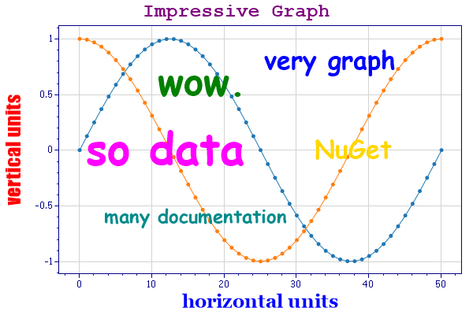


## Customize/PlotStyle - Legend


A legend is available to display data that was plotted using the 'label' argument. Arguments for Legend() allow the user to define its position.


```cs
var plt = new ScottPlot.Plot(600, 400);
int pointCount = 51;
double[] x = DataGen.Consecutive(pointCount);
double[] sin = DataGen.Sin(pointCount);
double[] cos = DataGen.Cos(pointCount);

plt.PlotScatter(x, sin, label: "sin");
plt.PlotScatter(x, cos, label: "cos");
plt.Legend();
plt.SaveFig("Customize_PlotStyle_CustomLegend.png");
```


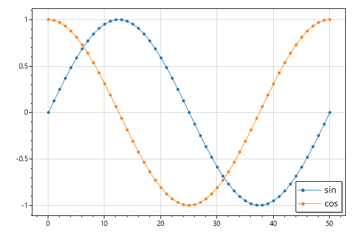


## Customize/PlotStyles - Plot Style (Default)


no description provided...


```cs
var plt = new ScottPlot.Plot(600, 400);
int pointCount = 51;
double[] x = DataGen.Consecutive(pointCount);
double[] sin = DataGen.Sin(pointCount);
double[] cos = DataGen.Cos(pointCount);

plt.PlotScatter(x, sin);
plt.PlotScatter(x, cos);

plt.Style(ScottPlot.Style.Default);
plt.SaveFig("Customize_PlotStyles_Default.png");
```


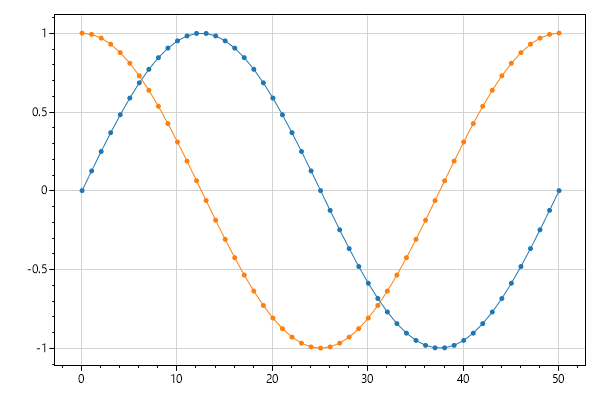


## Customize/PlotStyles - Plot Style (Control)


no description provided...


```cs
var plt = new ScottPlot.Plot(600, 400);
int pointCount = 51;
double[] x = DataGen.Consecutive(pointCount);
double[] sin = DataGen.Sin(pointCount);
double[] cos = DataGen.Cos(pointCount);

plt.PlotScatter(x, sin);
plt.PlotScatter(x, cos);

plt.Style(ScottPlot.Style.Control);
plt.SaveFig("Customize_PlotStyles_Control.png");
```


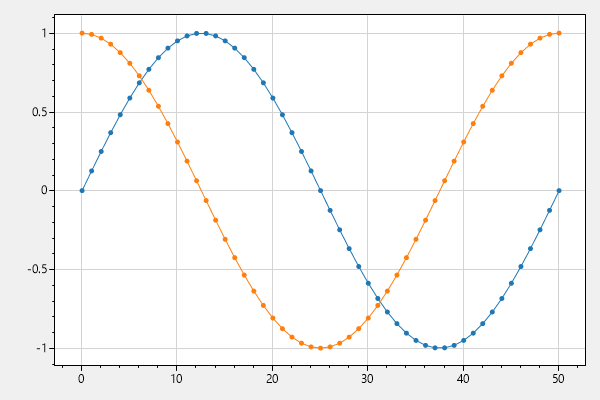


## Customize/PlotStyles - Plot Style (Blue1)


no description provided...


```cs
var plt = new ScottPlot.Plot(600, 400);
int pointCount = 51;
double[] x = DataGen.Consecutive(pointCount);
double[] sin = DataGen.Sin(pointCount);
double[] cos = DataGen.Cos(pointCount);

plt.PlotScatter(x, sin);
plt.PlotScatter(x, cos);

plt.Style(ScottPlot.Style.Blue1);
plt.SaveFig("Customize_PlotStyles_Blue1.png");
```


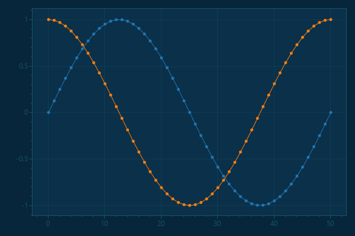


## Customize/PlotStyles - Plot Style (Blue2)


no description provided...


```cs
var plt = new ScottPlot.Plot(600, 400);
int pointCount = 51;
double[] x = DataGen.Consecutive(pointCount);
double[] sin = DataGen.Sin(pointCount);
double[] cos = DataGen.Cos(pointCount);

plt.PlotScatter(x, sin);
plt.PlotScatter(x, cos);

plt.Style(ScottPlot.Style.Blue2);
plt.SaveFig("Customize_PlotStyles_Blue2.png");
```


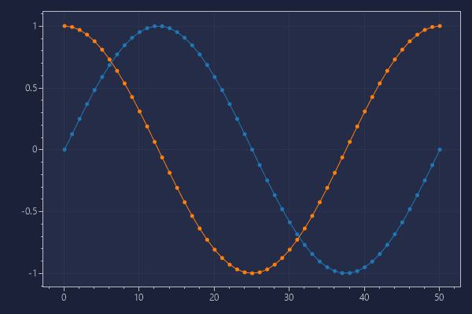


## Customize/PlotStyles - Plot Style (Blue3)


no description provided...


```cs
var plt = new ScottPlot.Plot(600, 400);
int pointCount = 51;
double[] x = DataGen.Consecutive(pointCount);
double[] sin = DataGen.Sin(pointCount);
double[] cos = DataGen.Cos(pointCount);

plt.PlotScatter(x, sin);
plt.PlotScatter(x, cos);

plt.Style(ScottPlot.Style.Blue3);
plt.SaveFig("Customize_PlotStyles_Blue3.png");
```


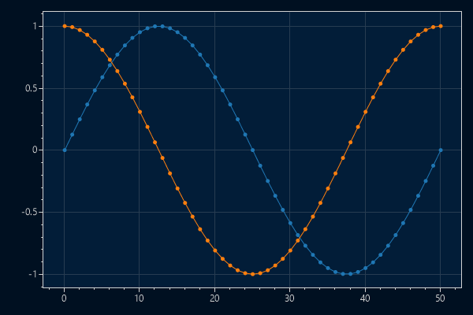


## Customize/PlotStyles - Plot Style (Light1)


no description provided...


```cs
var plt = new ScottPlot.Plot(600, 400);
int pointCount = 51;
double[] x = DataGen.Consecutive(pointCount);
double[] sin = DataGen.Sin(pointCount);
double[] cos = DataGen.Cos(pointCount);

plt.PlotScatter(x, sin);
plt.PlotScatter(x, cos);

plt.Style(ScottPlot.Style.Light1);
plt.SaveFig("Customize_PlotStyles_Light1.png");
```


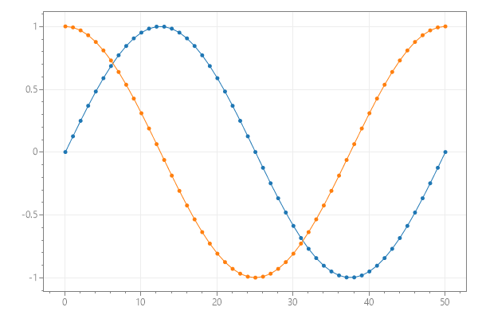


## Customize/PlotStyles - Plot Style (Light2)


no description provided...


```cs
var plt = new ScottPlot.Plot(600, 400);
int pointCount = 51;
double[] x = DataGen.Consecutive(pointCount);
double[] sin = DataGen.Sin(pointCount);
double[] cos = DataGen.Cos(pointCount);

plt.PlotScatter(x, sin);
plt.PlotScatter(x, cos);

plt.Style(ScottPlot.Style.Light2);
plt.SaveFig("Customize_PlotStyles_Light2.png");
```


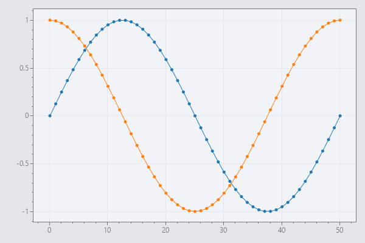


## Customize/PlotStyles - Plot Style (Gray1)


no description provided...


```cs
var plt = new ScottPlot.Plot(600, 400);
int pointCount = 51;
double[] x = DataGen.Consecutive(pointCount);
double[] sin = DataGen.Sin(pointCount);
double[] cos = DataGen.Cos(pointCount);

plt.PlotScatter(x, sin);
plt.PlotScatter(x, cos);

plt.Style(ScottPlot.Style.Gray1);
plt.SaveFig("Customize_PlotStyles_Gray1.png");
```


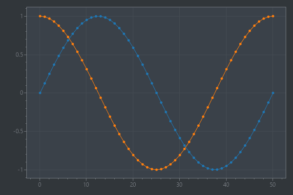


## Customize/PlotStyles - Plot Style (Gray2)


no description provided...


```cs
var plt = new ScottPlot.Plot(600, 400);
int pointCount = 51;
double[] x = DataGen.Consecutive(pointCount);
double[] sin = DataGen.Sin(pointCount);
double[] cos = DataGen.Cos(pointCount);

plt.PlotScatter(x, sin);
plt.PlotScatter(x, cos);

plt.Style(ScottPlot.Style.Gray2);
plt.SaveFig("Customize_PlotStyles_Gray2.png");
```


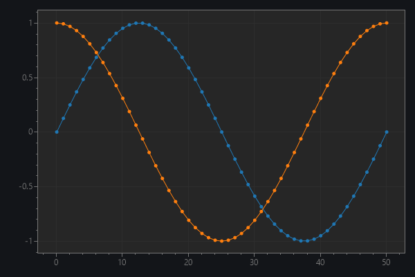


## Customize/PlotStyles - Plot Style (Black)


no description provided...


```cs
var plt = new ScottPlot.Plot(600, 400);
int pointCount = 51;
double[] x = DataGen.Consecutive(pointCount);
double[] sin = DataGen.Sin(pointCount);
double[] cos = DataGen.Cos(pointCount);

plt.PlotScatter(x, sin);
plt.PlotScatter(x, cos);

plt.Style(ScottPlot.Style.Black);
plt.SaveFig("Customize_PlotStyles_Black.png");
```


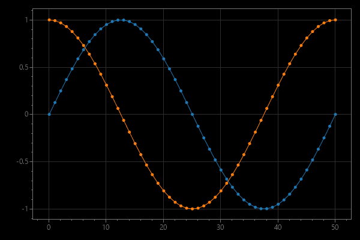


## Customize/Ticks - Hide Tick Labels


Tick label visibility can be controlled with arguments to the Ticks() method


```cs
var plt = new ScottPlot.Plot(600, 400);
int pointCount = 51;
double[] x = DataGen.Consecutive(pointCount);
double[] sin = DataGen.Sin(pointCount);
double[] cos = DataGen.Cos(pointCount);

plt.PlotScatter(x, sin);
plt.PlotScatter(x, cos);

plt.Ticks(displayTicksX: false);
plt.SaveFig("Customize_Ticks_Visibility.png");
```


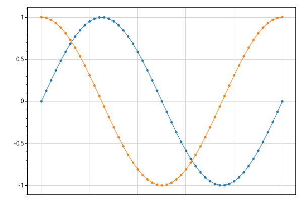


## Customize/Ticks - DateTime Axis


Axis tick labels can be set to display date and time format if the values (double[]) are OATime values.


```cs
var plt = new ScottPlot.Plot(600, 400);
Random rand = new Random(0);
double[] temperature = DataGen.RandomWalk(rand, 60 * 8);
DateTime start = new DateTime(2019, 08, 25, 8, 30, 00);
double pointsPerDay = 24 * 60;

plt.PlotSignal(temperature, sampleRate: pointsPerDay, xOffset: start.ToOADate());
plt.Ticks(dateTimeX: true);
plt.YLabel("Temperature (C)");
int pointCount = 20;

// create a series of dates
double[] dates = new double[pointCount];
var firstDay = new DateTime(2020, 1, 22);
for (int i = 0; i < pointCount; i++)
    dates[i] = firstDay.AddDays(i).ToOADate();

// simulate data for each date
double[] values = new double[pointCount];
Random rand = new Random(0);
for (int i = 1; i < pointCount; i++)
    values[i] = values[i - 1] + rand.NextDouble();

plt.PlotScatter(dates, values);
plt.Ticks(dateTimeX: true);

// define tick spacing as 1 day (every day will be shown)
plt.Grid(xSpacing: 1, xSpacingDateTimeUnit: Config.DateTimeUnit.Day);
plt.Ticks(dateTimeX: true, xTickRotation: 45);
plt.Layout(xScaleHeight: 60);
plt.SaveFig("Customize_Ticks_DateAxis.png");
```


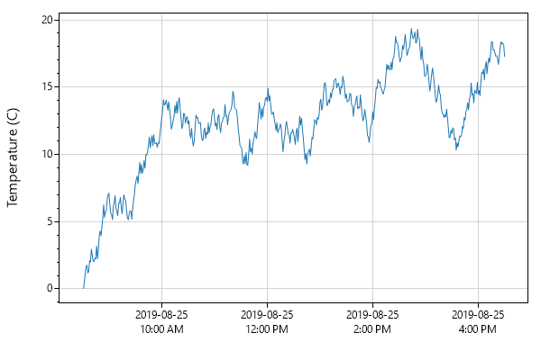


## Customize/Ticks - Define Tick Positions


An array of tick positions and labels can be manually defined.


```cs
var plt = new ScottPlot.Plot(600, 400);
int pointCount = 51;
double[] x = DataGen.Consecutive(pointCount);
double[] sin = DataGen.Sin(pointCount);
double[] cos = DataGen.Cos(pointCount);

plt.PlotScatter(x, sin);
plt.PlotScatter(x, cos);

double[] xPositions = { 7, 21, 37, 46 };
string[] xLabels = { "VII", "XXI", "XXXVII", "XLVI" };
plt.XTicks(xPositions, xLabels);

double[] yPositions = { -1, 0, .5, 1 };
string[] yPabels = { "bottom", "center", "half", "top" };
plt.YTicks(yPositions, yPabels);
plt.SaveFig("Customize_Ticks_Positions.png");
```


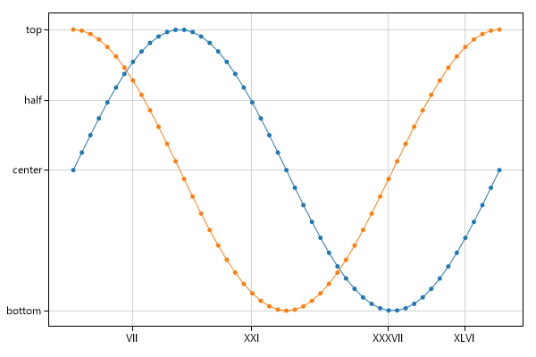


## Customize/Ticks - Descending Ticks


ScottPlot will ALWAYS display data where X values ascend from left to right. To simulate an inverted axis (where numbers decrease from left to right) plot data in the NEGATIVE space, then use a Tick() argument to invert the sign of tick labels.


```cs
var plt = new ScottPlot.Plot(600, 400);
// plot in the negative space
plt.PlotSignal(DataGen.Sin(50), xOffset: -50);

// then invert the sign of the axis tick labels
plt.Ticks(invertSignX: true);
plt.Ticks(invertSignY: true);
plt.SaveFig("Customize_Ticks_Inverted.png");
```


## Customize/Ticks - Defined Tick Spacing


The space between tick marks can be manually defined by setting the grid spacing.


```cs
var plt = new ScottPlot.Plot(600, 400);
int pointCount = 51;
double[] x = DataGen.Consecutive(pointCount);
double[] sin = DataGen.Sin(pointCount);
double[] cos = DataGen.Cos(pointCount);

plt.PlotScatter(x, sin);
plt.PlotScatter(x, cos);

plt.Grid(xSpacing: 2, ySpacing: .1);
plt.SaveFig("Customize_Ticks_DefineSpacing.png");
```


## Customize/Ticks - Localized Formatting (Hungarian)


Large numbers and dates are formatted differently for different cultures. This example demonstrates how to use a specific culture for formatting.


```cs
var plt = new ScottPlot.Plot(600, 400);
// generate some data
Random rand = new Random(0);
double[] price = ScottPlot.DataGen.RandomWalk(rand, 60 * 8, 10000);
DateTime start = new DateTime(2019, 08, 25, 8, 30, 00);
double pointsPerDay = 24 * 60;

// create the plot
plt.PlotSignal(price, sampleRate: pointsPerDay, xOffset: start.ToOADate());
plt.Ticks(dateTimeX: true);
plt.YLabel("Price");
plt.XLabel("Date and Time");
plt.Title("Hungarian Formatted DateTime Tick Labels");
plt.Ticks(useMultiplierNotation: false);

// set the localization
var culture = System.Globalization.CultureInfo.CreateSpecificCulture("hu"); // Hungarian
plt.SetCulture(culture);
plt.SaveFig("Customize_Ticks_LocalizedHungarian.png");
```


## Customize/Ticks - Localized Formatting (German)


Large numbers and dates are formatted differently for different cultures. This example demonstrates how to use a specific culture for formatting.


```cs
var plt = new ScottPlot.Plot(600, 400);
// generate some data
Random rand = new Random(0);
double[] price = ScottPlot.DataGen.RandomWalk(rand, 60 * 8, 10000);
DateTime start = new DateTime(2019, 08, 25, 8, 30, 00);
double pointsPerDay = 24 * 60;

// create the plot
plt.PlotSignal(price, sampleRate: pointsPerDay, xOffset: start.ToOADate());
plt.Ticks(dateTimeX: true);
plt.YLabel("Price");
plt.XLabel("Date and Time");
plt.Title("Hungarian Formatted DateTime Tick Labels");
plt.Ticks(useMultiplierNotation: false);

// set the localization
var culture = System.Globalization.CultureInfo.CreateSpecificCulture("de"); // German
plt.SetCulture(culture);
plt.SaveFig("Customize_Ticks_LocalizedGerman.png");
```


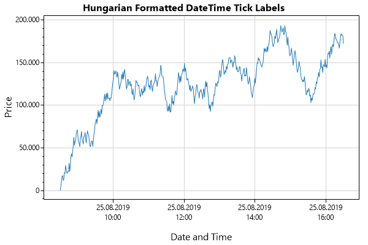


## Customize/Ticks - Format Ticks with Custom Culture


SetCulture() as arguments to let the user manually define formatting strings which will be used globally to change how numbers and dates are formatted.


```cs
var plt = new ScottPlot.Plot(600, 400);
// generate 10 days of data
int pointCount = 10;
double[] values = DataGen.RandomWalk(null, pointCount);
double[] days = new double[pointCount];
DateTime day1 = new DateTime(1985, 09, 24);
for (int i = 0; i < days.Length; i++)
    days[i] = day1.AddDays(1).AddDays(i).ToOADate();

// plot the data with custom tick format (https://tinyurl.com/ycwh45af)
plt.PlotScatter(days, values);
plt.Ticks(dateTimeX: true);
plt.SetCulture(shortDatePattern: "M\\/dd");
plt.SaveFig("Customize_Ticks_CustomCulture.png");
```


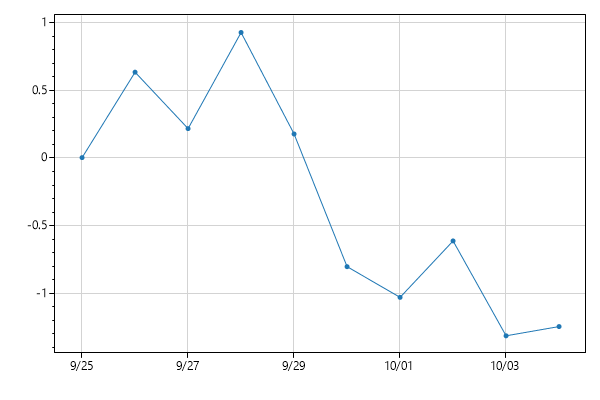


## Customize/Ticks - Accomodating Large Ticks


Large tick labels come with special layout considerations.


```cs
var plt = new ScottPlot.Plot(600, 400);
// generate LARGE data
Random rand = new Random(0);
double[] xs = ScottPlot.DataGen.Consecutive(100);
double[] ys = ScottPlot.DataGen.RandomWalk(rand, 100, 1e2, 1e15);
plt.PlotScatter(xs, ys);
plt.YLabel("vertical units");
plt.XLabel("horizontal units");

// turn off features which typically shorten tick label size
plt.Ticks(useOffsetNotation: false, useMultiplierNotation: false);

// tightening with a render is the best way to get the axes right
plt.TightenLayout(render: true);

plt.SaveFig("Customize_Ticks_Large.png");
```


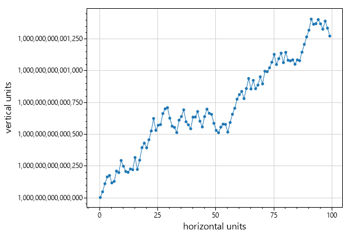


## Customize/Ticks - Multiplier Notation


To keep tick labels small 'multiplier' notation is used when their values are large.


```cs
var plt = new ScottPlot.Plot(600, 400);
Random rand = new Random(0);
int pointCount = 100;
double[] largeXs = DataGen.Consecutive(pointCount, spacing: 1e6);
double[] largeYs = DataGen.Random(rand, pointCount, multiplier: 1e6);

plt.PlotScatter(largeXs, largeYs);
plt.SaveFig("Customize_Ticks_MultiplierNotation.png");
```


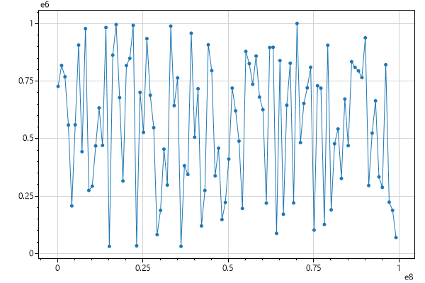


## Customize/Ticks - Disable Multiplier Notation


Multiplier notation can be disabled so tick labels are never abbreviated in this way.


```cs
var plt = new ScottPlot.Plot(600, 400);
Random rand = new Random(0);
int pointCount = 100;
double[] largeXs = DataGen.Consecutive(pointCount, spacing: 1e6);
double[] largeYs = DataGen.Random(rand, pointCount, multiplier: 1e6);

plt.PlotScatter(largeXs, largeYs);
plt.Ticks(useMultiplierNotation: false);
plt.SaveFig("Customize_Ticks_DisableMultiplierNotation.png");
```


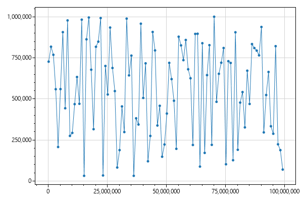


## Customize/Ticks - Offset Notation


To keep tick labels small 'offset' notation is used when their values are very far from zero.


```cs
var plt = new ScottPlot.Plot(600, 400);
Random rand = new Random(0);
int pointCount = 100;
double[] largeXs = DataGen.Consecutive(pointCount, offset: 1e6);
double[] largeYs = DataGen.Random(rand, pointCount, offset: 1e6);

plt.PlotScatter(largeXs, largeYs);
plt.SaveFig("Customize_Ticks_OffsetNotation.png");
```


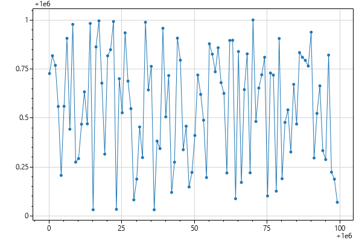


## Customize/Ticks - Disable Offset Notation


Offset notation can be disabled so tick labels are never abbreviated in this way.


```cs
var plt = new ScottPlot.Plot(600, 400);
Random rand = new Random(0);
int pointCount = 100;
double[] largeXs = DataGen.Consecutive(pointCount, offset: 1e6);
double[] largeYs = DataGen.Random(rand, pointCount, offset: 1e6);

plt.PlotScatter(largeXs, largeYs);
plt.Ticks(useOffsetNotation: false);
plt.SaveFig("Customize_Ticks_DisableOffsetNotation.png");
```


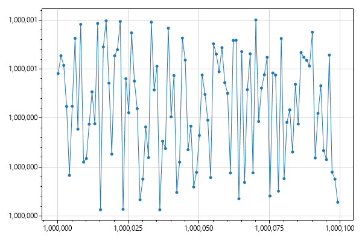


## Customize/Ticks - Rotated Ticks


Horizontal ticks can be rotated an arbitrary amount.


```cs
var plt = new ScottPlot.Plot(600, 400);
int pointCount = 51;
double[] x = DataGen.Consecutive(pointCount);
double[] sin = DataGen.Sin(pointCount);
double[] cos = DataGen.Cos(pointCount);

plt.PlotScatter(x, sin);
plt.PlotScatter(x, cos);

plt.Ticks(xTickRotation: 90);
plt.SaveFig("Customize_Ticks_RotatedTicks.png");
```


## Customize/Ticks - Defined DateTime Tick Spacing


This example shows how to use a fixed inter-tick distance.


```cs
var plt = new ScottPlot.Plot(600, 400);
int pointCount = 20;

// create a series of dates
double[] dates = new double[pointCount];
var firstDay = new DateTime(2020, 1, 22);
for (int i = 0; i < pointCount; i++)
    dates[i] = firstDay.AddDays(i).ToOADate();

// simulate data for each date
double[] values = new double[pointCount];
Random rand = new Random(0);
for (int i = 1; i < pointCount; i++)
    values[i] = values[i - 1] + rand.NextDouble();

plt.PlotScatter(dates, values);
plt.Ticks(dateTimeX: true);

// define tick spacing as 1 day (every day will be shown)
plt.Grid(xSpacing: 1, xSpacingDateTimeUnit: Config.DateTimeUnit.Day);
plt.Ticks(dateTimeX: true, xTickRotation: 45);
plt.Layout(xScaleHeight: 60);
plt.SaveFig("Customize_Ticks_DateAxisFixedSpace.png");
```


## Advanced/Multiplot - Multiplot Quickstart


Multiplots are single images which contain multiple subplots.


```cs
var plt = new ScottPlot.Plot(600, 400);
throw new InvalidOperationException("use Render(int, int) for IBitmapDemo objects");
plt.SaveFig("Advanced_Multiplot_Quickstart.png");
```


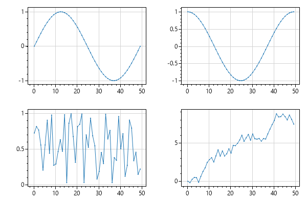


## Advanced/Multiplot - Match Subplot Axis


Axis and layout information from one subplot can be applied to another subplot.


```cs
var plt = new ScottPlot.Plot(600, 400);
throw new InvalidOperationException("use Render(int, int) for IBitmapDemo objects");
plt.SaveFig("Advanced_Multiplot_MatchAxis.png");
```


## Examples/Stats - Histogram


This example demonstrates how to plot the histogram of a dataset.


```cs
var plt = new ScottPlot.Plot(600, 400);
Random rand = new Random(0);
double[] values = DataGen.RandomNormal(rand, pointCount: 1000, mean: 50, stdDev: 20);
var hist = new Statistics.Histogram(values, min: 0, max: 100);

plt.PlotBar(hist.bins, hist.countsFrac);
plt.PlotScatter(hist.bins, hist.countsFracCurve, markerSize: 0, lineWidth: 2, color: Color.Black);
plt.Title("Normal Random Data");
plt.YLabel("Frequency (fraction)");
plt.XLabel("Value (units)");
plt.Axis(null, null, 0, null);
plt.SaveFig("Examples_Stats_Histogram.png");
```


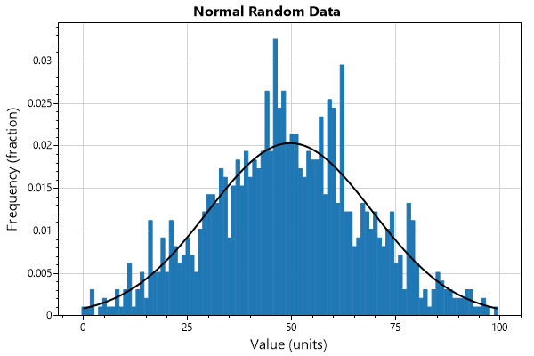


## Examples/Stats - CPH


This example demonstrates how to plot a cumulative probability histogram (CPH) to compare the distribution of two datasets.


```cs
var plt = new ScottPlot.Plot(600, 400);
// create sample data for two datasets
Random rand = new Random(0);
double[] values1 = DataGen.RandomNormal(rand, pointCount: 1000, mean: 50, stdDev: 20);
double[] values2 = DataGen.RandomNormal(rand, pointCount: 1000, mean: 45, stdDev: 25);
var hist1 = new ScottPlot.Statistics.Histogram(values1, min: 0, max: 100);
var hist2 = new ScottPlot.Statistics.Histogram(values2, min: 0, max: 100);

// display datasets as step plots
plt.Title("Cumulative Probability Histogram");
plt.YLabel("Probability (fraction)");
plt.XLabel("Value (units)");
plt.PlotStep(hist1.bins, hist1.cumulativeFrac, lineWidth: 1.5, label: "sample A");
plt.PlotStep(hist2.bins, hist2.cumulativeFrac, lineWidth: 1.5, label: "sample B");
plt.Legend();
plt.Axis(null, null, 0, 1);
plt.SaveFig("Examples_Stats_CPH.png");
```


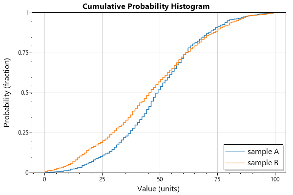


## Examples/Stats - Linear Regression


This example shows how to create a linear regression line for X/Y data.


```cs
var plt = new ScottPlot.Plot(600, 400);
// Create some linear but noisy data
Random rand = new Random(0);
double[] ys = ScottPlot.DataGen.NoisyLinear(rand, pointCount: 100, noise: 30);
double[] xs = ScottPlot.DataGen.Consecutive(ys.Length);
double x1 = xs[0];
double x2 = xs[xs.Length - 1];

// use the linear regression fitter to fit these data
var model = new ScottPlot.Statistics.LinearRegressionLine(xs, ys);

// plot the original data and add the regression line
plt.Title($"Y = {model.slope:0.0000}x + {model.offset:0.0}\nR² = {model.rSquared:0.0000}");
plt.PlotScatter(xs, ys, lineWidth: 0);
plt.PlotLine(model.slope, model.offset, (x1, x2), lineWidth: 2);
plt.SaveFig("Examples_Stats_LinReg.png");
```


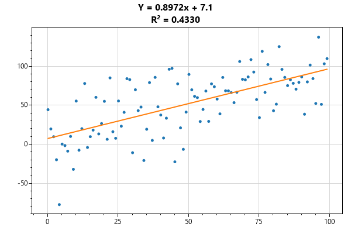


## Experimental/BoxAndWhisker - Box and Whisker (Stdev, Stderr, and Mean)


no description provided...


```cs
var plt = new ScottPlot.Plot(600, 400);
var boxAndWiskers = new Statistics.BoxAndWhisker[3];
boxAndWiskers[0] = Statistics.BoxAndWhiskerFromData.StdevStderrMean(Data.LineLengths.plot, 1);
boxAndWiskers[1] = Statistics.BoxAndWhiskerFromData.StdevStderrMean(Data.LineLengths.formsPlot, 2);
boxAndWiskers[2] = Statistics.BoxAndWhiskerFromData.StdevStderrMean(Data.LineLengths.wpfPlot, 3);

// note: this is how to add experimental plottables (which don't have methods in the Plot module)
PlottableBoxAndWhisker boxAndWhiskerPlot = new PlottableBoxAndWhisker(boxAndWiskers);
List<Plottable> plottablesList = plt.GetPlottables();
plottablesList.Add(boxAndWhiskerPlot);

plt.Title("Source Code Line Length");
plt.YLabel("Number of Characters");

double[] xPositions = { 1, 2, 3 };
string[] labels = { "Plot.cs", "FormsPlot.cs", "WpfPlot.cs" };
plt.XTicks(xPositions, labels);

plt.AxisAuto(.3, .2);
plt.SaveFig("Experimental_BoxAndWhisker_Quickstart.png");
```


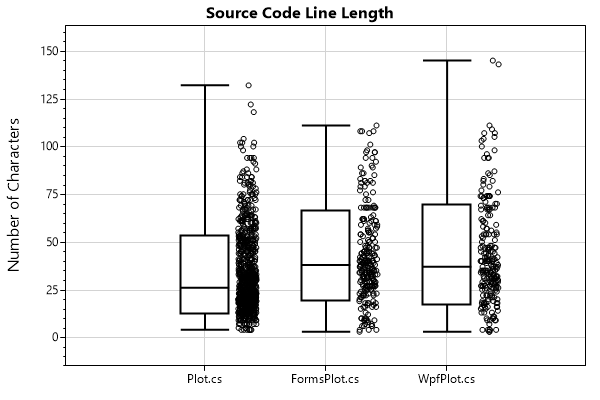


## Experimental/BoxAndWhisker - Box and Whisker (Outlier, Quartile, and Median)


no description provided...


```cs
var plt = new ScottPlot.Plot(600, 400);
var boxAndWiskers = new Statistics.BoxAndWhisker[3];
boxAndWiskers[0] = Statistics.BoxAndWhiskerFromData.OutlierQuartileMedian(Data.LineLengths.plot, 1);
boxAndWiskers[1] = Statistics.BoxAndWhiskerFromData.OutlierQuartileMedian(Data.LineLengths.formsPlot, 2);
boxAndWiskers[2] = Statistics.BoxAndWhiskerFromData.OutlierQuartileMedian(Data.LineLengths.wpfPlot, 3);

// note: this is how to add experimental plottables (which don't have methods in the Plot module)
PlottableBoxAndWhisker boxAndWhiskerPlot = new PlottableBoxAndWhisker(boxAndWiskers);
List<Plottable> plottablesList = plt.GetPlottables();
plottablesList.Add(boxAndWhiskerPlot);

plt.Title("Source Code Line Length");
plt.YLabel("Number of Characters");

double[] xPositions = { 1, 2, 3 };
string[] labels = { "Plot.cs", "FormsPlot.cs", "WpfPlot.cs" };
plt.XTicks(xPositions, labels);

plt.AxisAuto(.3, .2);
plt.SaveFig("Experimental_BoxAndWhisker_Advanced.png");
```


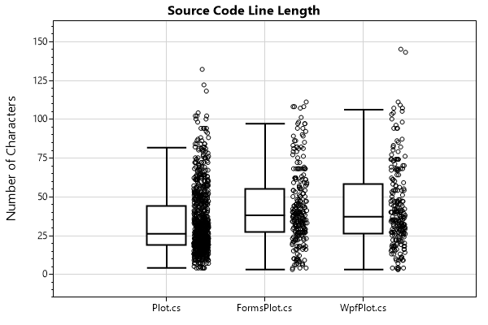


## Experimental/CustomPlottables - Add a Plottable Manually


Demonstrates how to add a Plottable to the plot without relying on a method in the Plot module.


```cs
var plt = new ScottPlot.Plot(600, 400);
// rather than call Plot.Text(), create the Plottable object manually
var customPlottable = new PlottableText(text: "test", x: 2, y: 3, 
    color: System.Drawing.Color.Magenta, fontName: "arial", fontSize: 26, 
    bold: true, label: "", alignment: TextAlignment.middleCenter,
    rotation: 0, frame: false, frameColor: System.Drawing.Color.Green);

// you can access properties which may not be exposed by a Plot method
customPlottable.rotation = 45;

// add the custom plottable to the list of plottables like this
List<Plottable> plottables = plt.GetPlottables();
plottables.Add(customPlottable);
plt.SaveFig("Experimental_CustomPlottables_AddPlottable.png");
```


